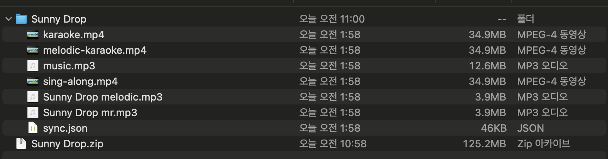

# Karaoke Simulator

영상 또는 음악 파일을 받아서 노래방 영상으로 만들 수 있는 에디터입니다.

https://norae.songgot.co.kr/

여기서 직접 해볼 수 있습니다.

## 사용법

1. 영상이나 음악 파일을 넣고 [시작] 버튼을 누릅니다.

2. 서버에서 MR과 보컬을 나누는 동안 가사를 입력합니다.

    2-1. 한국 노래일 경우 가사를 검색해서 가사 창에 붙여넣으면 됩니다.

    2-2. 일본 노래일 경우 [가사 검색] 버튼을 이용하면 한국어 발음으로 된 가사를 얻을 수 있습니다.

3. 가사가 너무 길어서 화면을 벗어날 경우 직접 나눠주거나 [가사 분리] 버튼을 이용합니다.

4. 노래의 박자에 맞춰 A키를 눌러서 박자를 입력할 수 있습니다.

5. 음절을 닫고 싶으면 S키를 눌러서 닫을 수 있습니다.

6. 음파 모양 버튼을 눌러서 음정을 확인할 수 있습니다.

7. 추측된 음이 틀렸을 경우 위쪽/아래쪽 방향키로 음정을 1키씩 조절할 수 있습니다.

8. Shift + 위쪽/아래쪽 방향키를 통해 옥타브(높은도 -> 낮은도)를 조절할 수 있습니다.

9. 가사에 박자가 모두 들어가면 빌드를 할 수 있습니다.

10. 빌드를 하면 작업했던 영상과 mr 그리고 박자 데이터가 담긴 json이 압축된 zip 파일로 다운로드됩니다.

11. 해당 zip 파일은 맨 첫화면에서 넣으면 가사/박자 정보를 수정할 수 있습니다.

## 작업 예시

<video src="attach/demo.mp4" width="320" height="240" controls></video>

## 빌드 결과물

zip 파일 형태의 출력물과 압축 해제한 모습

karaoke.mp4(반주 + 영상 + 가사 하이라이팅)

<video src="attach/karaoke.mp4" width="320" height="240" controls></video>

melodic-karaoke.mp4(반주 + 보컬 멜로디 라인 + 영상 + 가사 하이라이팅)

<video src="attach/melodic-karaoke.mp4" width="320" height="240" controls></video>

## 기술 스택

1. React

2. Next.js

3. Spleeter

4. Google Cloud Platform